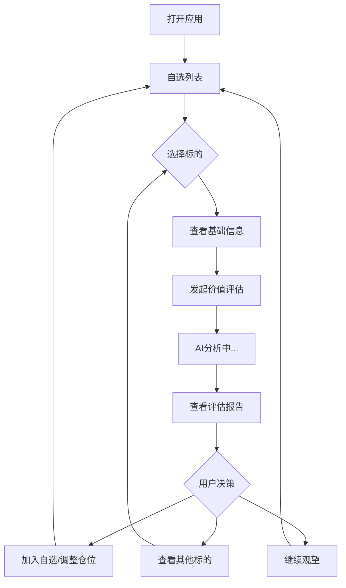

# 哼哼哈哈 - 业务流程与页面布局设计

## 一、用户旅程 (User Journey)

### 核心流程



### 详细步骤

1. **发现阶段**: 用户通过其他渠道(新闻、朋友推荐等)发现感兴趣的投资标的
2. **输入阶段**: 在哼哼哈哈中输入股票代码或基金代码
3. **评估阶段**: 查看基础信息,发起AI价值评估
4. **决策阶段**: 基于评估报告,做出投资决策
5. **跟踪阶段**: 将标的加入自选,定期复评

---

## 二、页面结构重新设计

### 2.1 首页 - 自选列表

**定位**: 用户的投资组合概览和快速入口

```
┌─────────────────────────────────────┐
│  哼哼哈哈                            │
│  ━━━━━━━━━━━━━━━━━━━━━━━━━━━━━━  │
│  [搜索框: 输入股票/基金代码]        │
├─────────────────────────────────────┤
│  我的自选 (3)                        │
│  ━━━━━━━━━━━━━━━━━━━━━━━━━━━━━━  │
│  ┌─────────────────────────────┐   │
│  │ 贵州茅台 600519.SH           │   │
│  │ ¥1,725.00  +2.5%             │   │
│  │ 评估: ⭐⭐⭐⭐☆ (75分)       │   │
│  │ 最近评估: 2天前              │   │
│  └─────────────────────────────┘   │
│  ┌─────────────────────────────┐   │
│  │ VWRA 基金                    │   │
│  │ $105.23  -0.8%               │   │
│  │ 评估: ⭐⭐⭐⭐⭐ (88分)       │   │
│  │ 最近评估: 1周前              │   │
│  └─────────────────────────────┘   │
│                                     │
│  [+ 添加新标的]                     │
└─────────────────────────────────────┘
```

**关键元素**:
- ✅ 搜索框(主要入口)
- ✅ 自选列表(显示评估分数和时间)
- ✅ 快速添加按钮
- ✅ 评估状态一目了然

---

### 2.2 标的详情页 - 重新设计

**定位**: 信息展示 + 评估入口

#### 页面结构(新版)

```
┌─────────────────────────────────────┐
│  ← 贵州茅台 (600519.SH)              │
├─────────────────────────────────────┤
│  SECTION 1: 基础行情                 │
│  ━━━━━━━━━━━━━━━━━━━━━━━━━━━━━━  │
│  ¥1,725.00  +2.5% (+42.00)          │
│  成交量: 1.2M  | 换手率: 0.8%        │
│  市值: 2.16T   | 市盈率: 32.5        │
├─────────────────────────────────────┤
│  SECTION 2: 快速评估概览             │
│  ━━━━━━━━━━━━━━━━━━━━━━━━━━━━━━  │
│  上次评估: 2天前                     │
│  综合评分: ⭐⭐⭐⭐☆ (75/100)       │
│                                     │
│  [🔄 重新评估]  [📊 查看详细报告]   │
├─────────────────────────────────────┤
│  SECTION 3: 价格走势                 │
│  ━━━━━━━━━━━━━━━━━━━━━━━━━━━━━━  │
│  [K线图/折线图]                     │
│  [1D] [5D] [1M] [3M] [1Y] [ALL]     │
├─────────────────────────────────────┤
│  SECTION 4: 关键指标                 │
│  ━━━━━━━━━━━━━━━━━━━━━━━━━━━━━━  │
│  估值水平: 偏高 ⚠️                  │
│  波动性: 中等                        │
│  流动性: 良好                        │
│  行业周期: 复苏期                    │
├─────────────────────────────────────┤
│  SECTION 5: 财务数据(股票)           │
│  或 基金持仓(基金)                   │
│  ━━━━━━━━━━━━━━━━━━━━━━━━━━━━━━  │
│  [展开查看详细数据]                  │
└─────────────────────────────────────┘

[固定底部按钮]
┌─────────────────────────────────────┐
│  [✨ 开始价值评估]                   │
└─────────────────────────────────────┘
```

**关键调整**:
1. ✅ 将"快速评估概览"前置,让用户快速了解评估状态
2. ✅ 突出"重新评估"和"查看详细报告"两个核心动作
3. ✅ 简化信息层级,减少滚动
4. ✅ 底部固定评估按钮

---

### 2.3 评估报告页 - 核心页面重新设计

**定位**: 价值评估的核心呈现

#### 页面结构(新版)

```
┌─────────────────────────────────────┐
│  ← 价值评估报告                      │
│  贵州茅台 (600519.SH)                │
│  评估时间: 2025-12-11 17:00          │
├─────────────────────────────────────┤
│  📊 综合评分                         │
│  ━━━━━━━━━━━━━━━━━━━━━━━━━━━━━━  │
│         ⭐⭐⭐⭐☆                    │
│          75 / 100                   │
│                                     │
│  适合: 长期价值投资者                │
│  建议持有周期: 3年以上               │
│  建议仓位: ≤15%                     │
├─────────────────────────────────────┤
│  💎 价值分析                         │
│  ━━━━━━━━━━━━━━━━━━━━━━━━━━━━━━  │
│  估值水平: 合理偏高 ⚠️               │
│                                     │
│  • PE: 32.5 (行业均值: 28.3)        │
│  • PB: 12.8 (历史均值: 10.5)        │
│  • 估值溢价: +15%                    │
│                                     │
│  性价比评分: 65/100                  │
│  [展开详细分析 ▼]                    │
├─────────────────────────────────────┤
│  ⚡ 机会洞察                         │
│  ━━━━━━━━━━━━━━━━━━━━━━━━━━━━━━  │
│  发现 3 个有利因素:                  │
│                                     │
│  ✓ 品牌护城河深厚,定价权强           │
│  ✓ 现金流充沛,分红稳定               │
│  ✓ 技术面呈现筑底形态                │
│                                     │
│  [展开详细分析 ▼]                    │
├─────────────────────────────────────┤
│  ⚠️ 需要关注的风险点                 │
│  ━━━━━━━━━━━━━━━━━━━━━━━━━━━━━━  │
│  识别到 3 个风险点:                  │
│                                     │
│  • 估值处于历史高位                  │
│    影响: 中等 | 建议: 分批建仓       │
│                                     │
│  • 短期波动性较大(25%)               │
│    影响: 低 | 建议: 长期持有         │
│                                     │
│  • 宏观经济放缓风险                  │
│    影响: 中等 | 建议: 关注政策       │
│                                     │
│  [展开详细分析 ▼]                    │
├─────────────────────────────────────┤
│  📈 周期与趋势                       │
│  ━━━━━━━━━━━━━━━━━━━━━━━━━━━━━━  │
│  行业周期: 复苏期                    │
│  技术趋势: 筑底阶段                  │
│  资金流向: 小幅流入                  │
│                                     │
│  [展开详细分析 ▼]                    │
├─────────────────────────────────────┤
│  💡 评估总结                         │
│  ━━━━━━━━━━━━━━━━━━━━━━━━━━━━━━  │
│  该标的具有良好的长期投资价值,       │
│  但当前估值偏高,建议等待更好时机。   │
│  适合风险承受能力中等及以上的        │
│  长期投资者。                        │
├─────────────────────────────────────┤
│  [导出报告] [分享] [加入自选]        │
└─────────────────────────────────────┘

底部免责声明:
⚠️ 本评估仅供参考,不构成投资建议。
```

**核心设计原则**:

1. **金字塔结构**: 从总分到细节,层层递进
2. **可折叠设计**: 默认显示摘要,可展开查看详情
3. **视觉层次**: 用emoji和颜色区分不同模块
4. **行动导向**: 每个风险点都有"建议"
5. **避免绝对化**: 不说"高风险",而是"需要关注"

---

### 2.4 评估历史页

**定位**: 追踪评估变化,辅助决策

```
┌─────────────────────────────────────┐
│  ← 评估历史                          │
│  贵州茅台 (600519.SH)                │
├─────────────────────────────────────┤
│  评估记录 (5次)                      │
│  ━━━━━━━━━━━━━━━━━━━━━━━━━━━━━━  │
│  ┌─────────────────────────────┐   │
│  │ 2025-12-11  ⭐⭐⭐⭐☆ 75分   │   │
│  │ 估值: 偏高 | 建议: 观望      │   │
│  │ [查看详情]                   │   │
│  └─────────────────────────────┘   │
│  ┌─────────────────────────────┐   │
│  │ 2025-12-09  ⭐⭐⭐⭐☆ 73分   │   │
│  │ 估值: 合理 | 建议: 可关注    │   │
│  │ [查看详情]                   │   │
│  └─────────────────────────────┘   │
│                                     │
│  [评分趋势图]                        │
└─────────────────────────────────────┘
```

---

## 三、交互流程优化

### 3.1 评估触发流程

**当前问题**: 用户需要滚动到底部才能触发评估

**优化方案**:

```
方案A: 双入口设计
- 详情页顶部: "快速评估概览" + [重新评估]按钮
- 详情页底部: [开始价值评估]固定按钮

方案B: 智能提示
- 如果超过7天未评估,顶部显示提示条
- "该标的已7天未评估,建议重新评估"
```

### 3.2 评估结果展示流程

**当前问题**: 评估结果信息过多,用户难以快速抓住重点

**优化方案**:

```
1. 分层展示
   - 第一层: 综合评分 + 一句话总结
   - 第二层: 三大维度摘要(默认折叠)
   - 第三层: 详细数据(点击展开)

2. 关键信息高亮
   - 用颜色区分: 绿色(有利)、黄色(中性)、橙色(需关注)
   - 用图标增强: ✓ ⚠️ ⚡ 💎

3. 行动建议明确
   - 每个风险点都有对应建议
   - 底部给出综合建议(持有周期、仓位比例)
```

---

## 四、信息架构

### 4.1 导航结构

```
底部Tab导航:
┌─────┬─────┬─────┬─────┐
│ 自选 │ 发现 │ 评估 │ 我的 │
└─────┴─────┴─────┴─────┘
```

**各Tab功能**:

1. **自选**: 
   - 我的自选列表
   - 快速搜索添加
   - 评估状态概览

2. **发现** (可选,未来功能):
   - 市场热点
   - 行业分析
   - 教育内容

3. **评估**:
   - 评估历史记录
   - 评估统计
   - 我的评估偏好设置

4. **我的**:
   - 设置(颜色约定等)
   - 帮助文档
   - 关于应用

### 4.2 信息优先级

**详情页信息优先级**:

```
P0 (必须看到):
- 当前价格和涨跌
- 评估状态(分数、时间)
- 评估入口按钮

P1 (重要):
- 价格走势图
- 关键指标(估值、波动性)
- 评估报告摘要

P2 (可选):
- 详细财务数据
- 技术指标详情
- 新闻资讯
```

---

## 五、文案规范

### 5.1 评估结果表述

**评分区间对应表述**:

| 分数 | 星级 | 表述 | 说明 |
|------|------|------|------|
| 90-100 | ⭐⭐⭐⭐⭐ | 优秀 | 价值突出,值得重点关注 |
| 75-89 | ⭐⭐⭐⭐☆ | 良好 | 具有投资价值,可适当配置 |
| 60-74 | ⭐⭐⭐☆☆ | 中等 | 价值一般,建议谨慎 |
| 40-59 | ⭐⭐☆☆☆ | 偏弱 | 价值有限,建议观望 |
| 0-39 | ⭐☆☆☆☆ | 较差 | 不建议当前时机配置 |

### 5.2 风险点表述模板

```
[风险类型]: [具体描述]
影响程度: [高/中/低]
建议: [具体行动建议]

示例:
估值风险: 当前PE为32.5,高于行业均值15%
影响程度: 中等
建议: 建议分批建仓,避免一次性重仓
```

---

## 六、实施优先级

### Phase 1: 核心流程优化 (2周)

- [ ] 重构评估报告页面结构
- [ ] 实现分层折叠展示
- [ ] 优化评估触发流程
- [ ] 统一文案表述

### Phase 2: 交互体验提升 (2周)

- [ ] 添加评估历史功能
- [ ] 实现智能评估提醒
- [ ] 优化加载和过渡动画
- [ ] 添加报告导出功能

### Phase 3: 功能扩展 (4周)

- [ ] 添加对比功能(同类标的对比)
- [ ] 个性化评估偏好
- [ ] 评估报告分享
- [ ] 教育内容模块

---

## 七、关键指标 (KPI)

### 用户行为指标

- **评估完成率**: 发起评估 → 查看完整报告的比例
- **评估频率**: 平均每个用户每周评估次数
- **报告停留时长**: 用户在评估报告页的平均停留时间
- **行动转化率**: 查看报告后加入自选的比例

### 产品质量指标

- **评估准确性**: 用户对评估结果的认可度(通过反馈收集)
- **信息完整性**: 评估报告包含的维度数量
- **响应速度**: 评估生成的平均时间

---

## 总结

基于"价值评估为主,风险识别为辅"的定位,新的业务流程和页面布局强调:

1. **快速评估**: 减少用户操作步骤,快速获得评估结果
2. **分层展示**: 从总分到细节,满足不同深度的信息需求
3. **行动导向**: 每个分析都配有明确的建议
4. **客观中立**: 避免绝对化表述,强调"参考"而非"建议"

这样的设计既符合产品定位,又能提供良好的用户体验。
